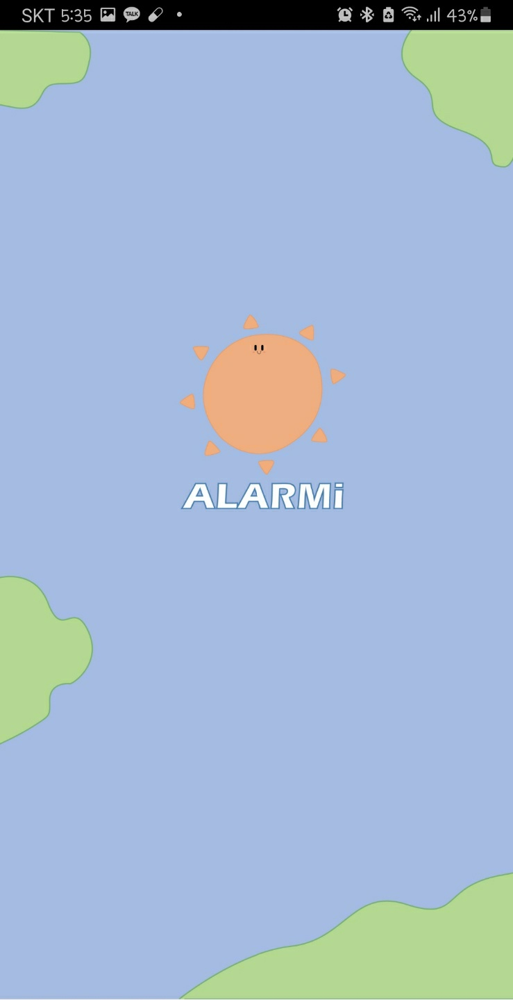
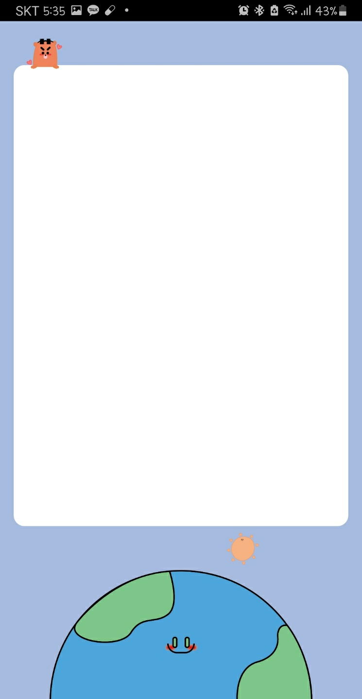
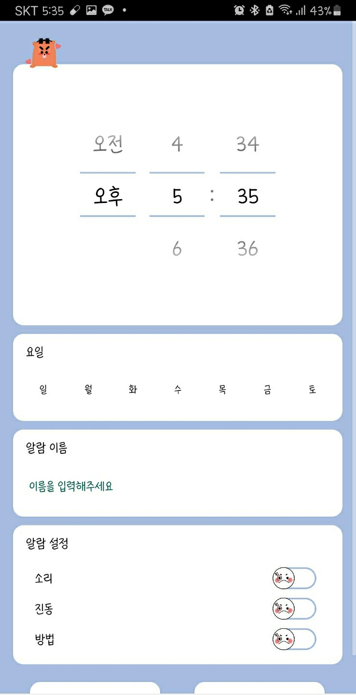
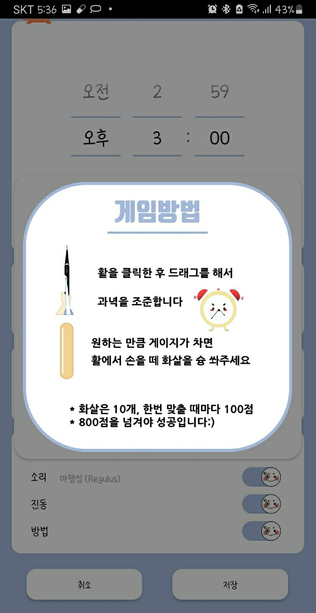

# ALARMi(게임 알람 어플)

+ 핸드폰 흔들기
+ 두더지 게임
+ 과녁 맞추기  
  
위의 총 3가지 게임을 활용해 알람을 사용할 수 있는 어플리케이션  

---
### 어플 사진

1. 시작화면

+ 시간 별로 오전은 해가 오후에는 달이 뜨도록 설정

2. 메인화면

3. 알람 세팅 화면

+ 게임을 설정하지 않고 소리와 진동만으로도 알람이 가능하도록 구현

4. 게임 화면

+ 게임 이름 옆에 느낌표를 클릭하면 설명 이미지 오픈  
+ 게임 목록의 오른쪽 끝부분의 버튼을 클릭하면 연습 게임 실행 가능
